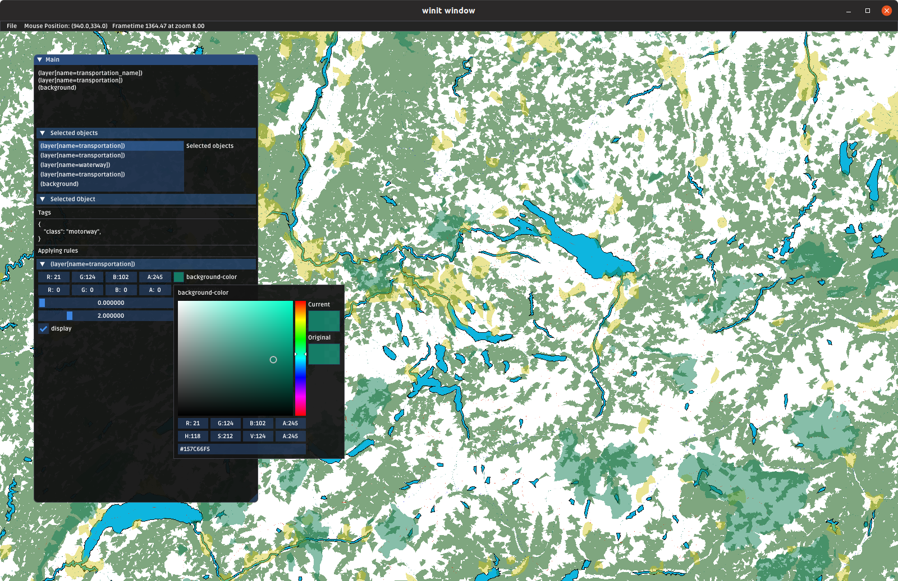

# Sailor

A sailing navigation application.



## Building

### Building for vulkan & Linux/Windows

```
cargo build --verbose --bin sailor
```

### Building for metal & macOS

```
cargo build --verbose --bin sailor --no-default-features --features metal
```

### Debug the Zurich Landesmuseeum tile

```
cargo run --release -- -t 14/8580/5737
```

Use any number of `-t` args to load multiple tiles. If no args are passed, load a full map.

# Profiling heap on macOS with Instruments

Install `cargo-instruments`

```
brew install cargo-instruments
```

Run `cargo instruments -t Allocations --release --time-limit 30000` and look at the generated trace in `target/instruments`.
